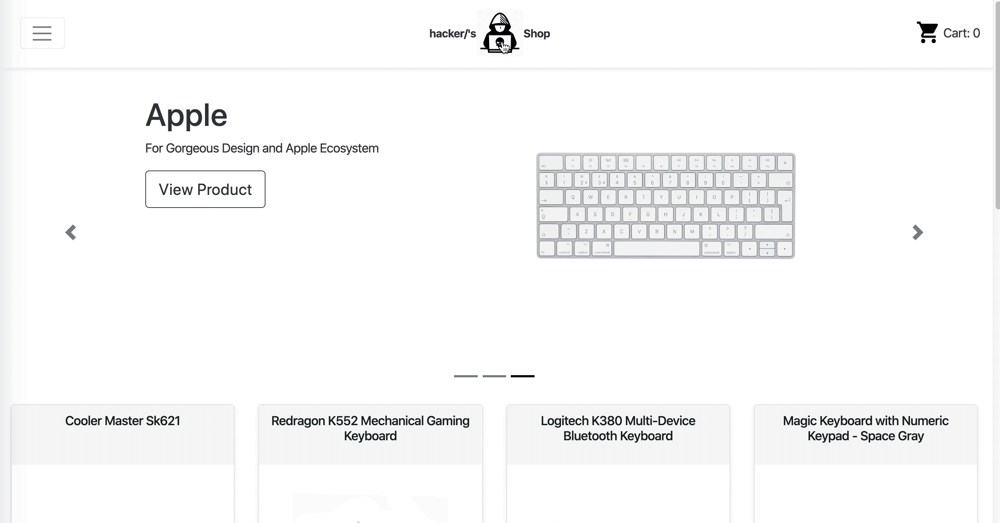

# hacker/'s Shop

hacker/'s Shop is a full stack LAMP shopping cart simulation app. It is a single-page React application and operates through dynamic PHP API. The app provides user with the ability to add keyboards and mice to their cart from a catalog, update the quantity of each item in the cart and delete selected items from the cart.

### Live Demo: [hackersshop.danielcseong.com](hackersshop.danielcseong.com)



## Getting Started

These instructions will get you a copy of the project up and running on your local machine for development and testing purposes. See deployment for notes on how to deploy the project on a live system.

### Initial Setup

1. Fork this repo and clone your fork from the terminal.

```
$ git clone https://github.com/[user_name]/hackersShop.git
```

2. Navigate into the cloned directory and install the necessary dependencies.

```
$ npm install
```

3. Start a dev environment with access to Apache and MySQL and:
* Check that port is directed to 3000
* Check that the root directory of the server is set to the public folder
* Initiate the dev server

```
$ npm run dev
```

4. Go to localhost:3000 and enjoy 😃


## Built With

* React.JS
* PHP
* HTML
* CSS
* Bootstrap

## Contributing

Please feel free to fork this repo, make changes, submit pull requests, and send suggestions to dseongdev@gmail.com to make this app better.

## Author

* **Daniel Seong** - *Initial work* - [dseong0224](https://github.com/dseong0224)
